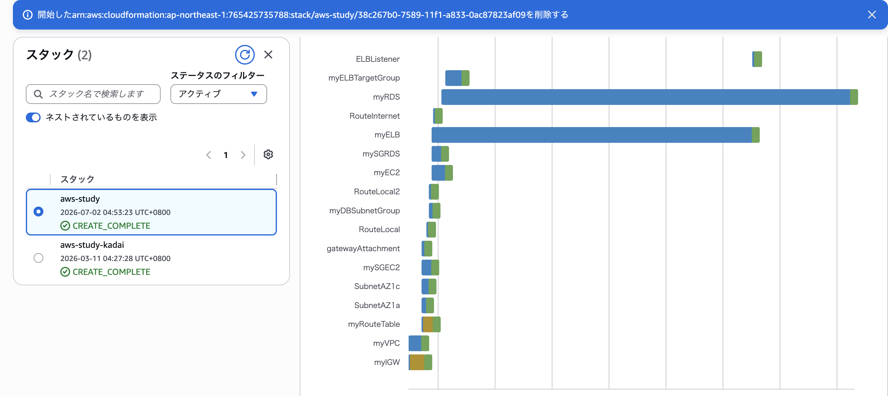
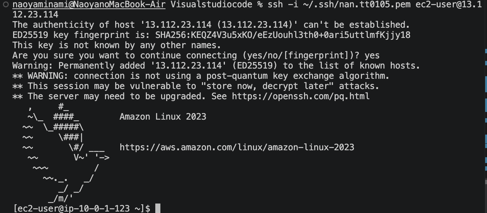
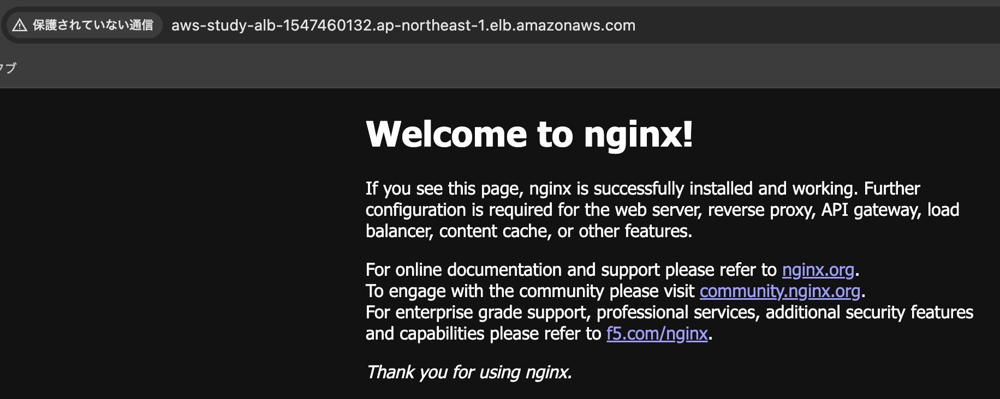

# AWS Study - CloudFormation Infrastructure

## Overview
This project provisions a full AWS infrastructure stack using CloudFormation, including VPC, EC2, RDS, and ALB.

## Architecture
- VPC (10.0.0.0/16) with 2 public subnets across AZ1a and AZ1c
- Internet Gateway + Route Table
- Security Groups for EC2 and RDS
- EC2 instance (Amazon Linux 2023, t3.micro) with Nginx
- RDS MySQL (db.t4g.micro) in a DB Subnet Group
- Application Load Balancer routing HTTP traffic to EC2

## Deployment Results

### CloudFormation CREATE_COMPLETE

### SSH Connection to EC2

### ALB Access (Welcome to nginx)

## Port Configuration Note

EC2 instance runs Nginx with its default configuration, listening directly on port 80 (no reverse proxy to a separate application such as Spring Boot). The ALB TargetGroup port (80) is intentionally aligned with this actual application configuration.
